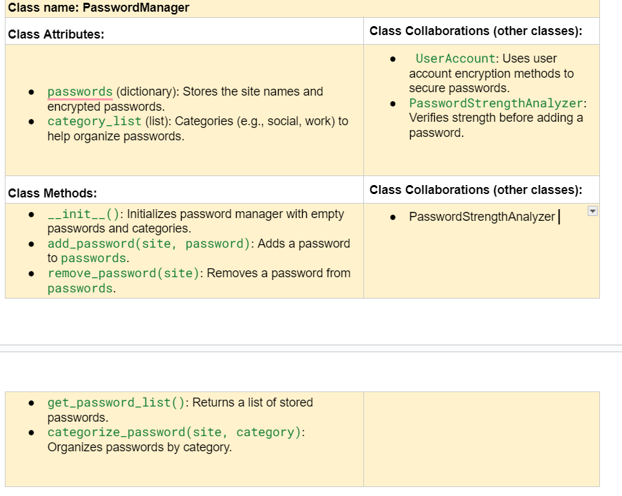

Dylan Roland

https://docs.google.com/document/d/1oH4hJl-JlcDOZQ5CA6M9rhFbbVT4kVvCcT-8QZkdfXY/edit?tab=t.0#heading=h.qg98s23ap4mh

---

## References 
Throughout this project, you have likely used outside resources. Reference all ideas which are not your own, 
and describe how you integrated the ideas or code into your program. This includes online sources, people who have 
helped you, AI tools you've used, and any other resources that are not solely your own contribution. Update as you go.

---

## Milestone 1: Setup, Planning, Design

`SafePass: AI-Enhanced Password Manager.`

`SafePass is a password management tool that analyzes the strength of user passwords, offers suggestions for improvement, and securely stores passwords`

File handling (for saving passwords)
Dictionaries and Lists (for storing password rules and categorizing passwords) 
GUI basics (for making the user interface interactive with Tkinter or Pygame)
Classes and Objects (to manage user accounts, passwords, and password rules)' 


  


```
    Branch 1 name: rolandd
```
---

## Milestone 2: Code Setup and Issue Queue

Most importantly, keep your issue queue up to date, and focus on your code. 🙃

Reflect on what you’ve done so far. How’s it going? Are you feeling behind/ahead? What are you worried about? 
What has surprised you so far? Describe your general feelings. Be honest with yourself; this section is for you, not me.

```
    So far, the project feels manageable, but there are a lot of moving parts to coordinate. I feel like I’m slightly behind because I underestimated how much time it would take to properly stub out all functions and build a cohesive plan. I’m a little worried about the integration between the modules, especially ensuring the encryption and password manager work seamlessly together.

What surprised me the most is how much clarity writing out the top-down design brought to the process. Breaking tasks into smaller parts has made implementation feel less overwhelming. Overall, I’m cautiously optimistic but know there’s a lot left to do.
```

---

## Milestone 3: Virtual Check-In

Indicate what percentage of the project you have left to complete and how confident you feel. 

 `60%`


```
    I feel moderately confident about completing the project. The main challenges will be:

Implementing the encryption and persistent storage effectively.
Debugging any issues with the user interface flow.
To increase the likelihood of success, I plan to:

Stick to the incremental development strategy, focusing on one module or feature at a time.
Commit frequently to track progress and prevent getting overwhelmed by large changes.
Dedicate specific blocks of time each day to work on the project, ensuring consistent progress.
With these strategies in place, I’m confident I’ll finish before the deadline.
```

---

## Milestone 4: Final Code, Presentation, Demo

After hitting the **"Run"** button in PyCharm, the **SafePass** program will open a graphical user interface (GUI) window. From the main menu, users can choose to **Login**, **Register**, or **Exit** the program. If you are a new user, click **Register**, then enter a username and a strong master password. Once registered, you will be redirected to the **Login screen**, where you can enter your credentials. Upon successful login, you will access the **Dashboard**, where you can manage your passwords. To **add a password**, click "Add Password," enter the site name and the password you want to save, and click **Save**. To **retrieve a password**, click "Retrieve Password," enter the site name, and the program will display the saved password. You can also log out at any time to return to the main menu. All passwords are **encrypted** before being saved and **decrypted** only when retrieved, ensuring maximum security.

For my final project, I selected SafePass, a secure password manager, because I wanted to challenge myself with a project that combined concepts from cybersecurity, software engineering, and user interface design. This project gave me the opportunity to implement user authentication, encryption, password strength analysis, and GUI development. Password management is a real-world problem that affects everyday users, so building a tool like this allowed me to create something with practical value. It also gave me the chance to apply what I’ve learned about object-oriented programming (OOP), file handling, and data security, all while working on a project that felt meaningful.

The final version of SafePass closely reflected my initial design, but there were some changes along the way. Originally, I planned for a simple command-line interface (CLI) where users would log in, register, and manage their passwords using typed commands. However, as I worked on the project, I decided to upgrade the user experience by building a graphical user interface (GUI) with Tkinter. This change significantly improved the program's usability and made it feel more polished. I also added a password strength analyzer to give users feedback on how strong their passwords were, which wasn't part of my original design. While I accomplished all the core features I had planned, these additions made the final product more comprehensive and user-friendly.

One of the biggest lessons I learned during this project was the importance of error handling and edge case management. Early on, I focused on implementing the "happy path" — where everything works perfectly — but I quickly realized how often things can go wrong. For example, missing files, incorrect inputs, and failed logins could crash the program. To address this, I implemented try/except blocks to handle these errors gracefully. I also learned the value of data security, especially when it came to password encryption. Using AES encryption (Fernet) to encrypt sensitive information and bcrypt to hash master passwords gave me insight into how secure applications manage user data. These experiences taught me how to design more robust, secure, and user-friendly applications.

If I were to do this project again, I would start with a more structured approach to testing and modular design. Early on, I wrote large, complex functions, which became hard to manage as the project grew. Later, I had to refactor these into smaller, reusable methods. Next time, I would follow a test-driven development (TDD) approach by writing tests first and ensuring every feature works before moving on. This would help catch edge cases and security flaws earlier in the process. I would also add more automated testing to check for issues like file corruption, failed logins, and incorrect decryption. Finally, I would add user experience improvements, like allowing users to reset their master passwords or recover lost accounts. These changes would make the program more reliable, maintainable, and professional.